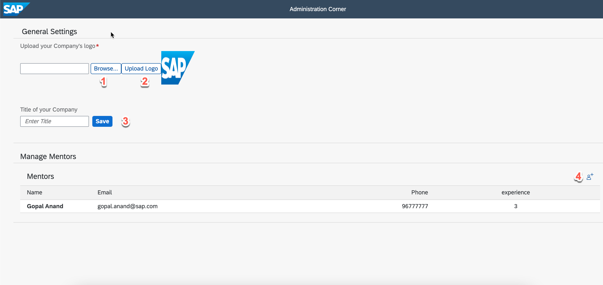

# Understand the Admin User Interface

The Admin User Interface is used by the administrator to set the company name, logo and mentor master data of the company that is subscribed to the applicaiton.

You can access the application from the subscriber subaccount, and then append `\adminui\` to the end of the URL to access the Admin User Interface.
To access the User Interface, Launch the subscribed application from `Instance and Subscriptions` section of subscriber subaccount. 
Here's a preview of the Admin User Interface and how you can use it:

1. Choose the logo from your local file system.
2. Upload the logo to the database.
3. Set the company name.
4. To create new mentor master data, choose `+`.

## Credits

This project has been generated with [easy-ui5](https://github.com/SAP).
