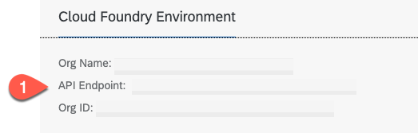
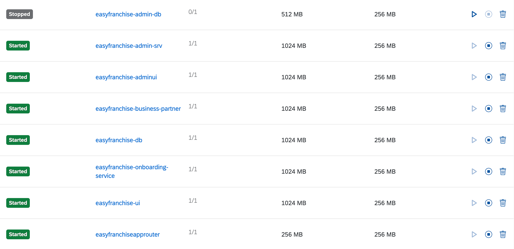

# Build and Deploy the Easy Franchise Application.

For building and deploying the application we use the Multi-target Application Model (mta). You can either use your local environment or SAP Business Application Studio. 


### Clone the resources

You get the Easy Franchise sample application from our git repository:

Open a terminal or your command line interface and clone the solution:

```cmd
git clone https://github.com/SAP-samples/btp-cf-multitenant-extension.git
``` 

### Configuration
As we want roll-out Easy Franchise as a SaaS solution we have to make the name of the solution unique for your account.   

Open the **mta.yaml** file. In the **SaaS registry Service** section change the **xsappname** and **appName** parameters to your preferred name. 

```yaml
## SaaS registry Service
  - name: es-saas
    type: org.cloudfoundry.managed-service
    requires:
      - name: onboarding-api
    parameters:
      service: saas-registry
      service-plan: application
      config:
        xsappname: easyfranchise-yourname
        appName: easyfranchise-yourname
        displayName: Easy Franchise
        description: Multitenant Rental applicaition
        category: 'Refapps'
        appUrls:

```
Open the **./configuration/xs-security.json** file. Again change the **xsappname** to the same value as in the mta.yaml.

```json

    "xsappname": "easyfranchise-yourname",
    "tenant-mode": "shared",
    "description": "Security profile of Easy Franchise",
    "authorities":["$ACCEPT_GRANTED_AUTHORITIES"],
    "scopes": [

```
Save your changes!


### Build the application

Build your application by using the mta.yaml build file. With the -t parameter the file will be created in the specified folder.

```cmd
mbt build -t ./mta_archives

```


### Logon to your SAP BTP subaccount

1. Set the SAP BTP API endpoint - you find it in overview of your SAP BTP subaccount

    

    ```cmd
    cf api <your-api endpoint>
    ```

2. Login to your subaccount and space

   ```cmd
   cf login -u <your-user> -p <your-password>

   -- then select your org and space
    ```


### Deploy the mta archive

Now you can deploy the application to your subacccount and space by using the created mtar file:

```cmd
cd mta_archives
cf deploy easyfranchise_1.0.0.mtar
```
If the deployment was successful you can check in the Applications section of your space if all the modules are running (exception: admin-db is only used during deployment and is then stopped).




