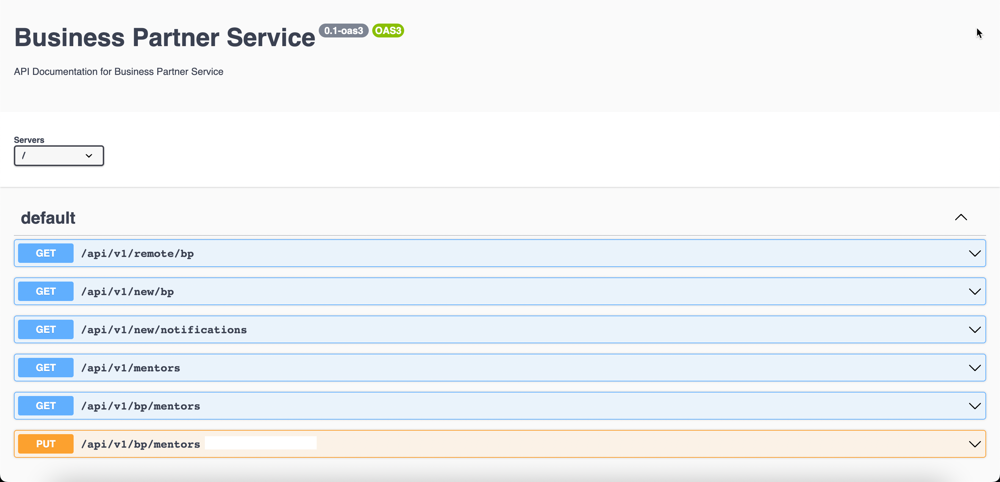

# Business Partner Service
This microservice is the core of this applicaiton. Highlighted in the below diagram.

# API Endpoints 
The API endpoints can be accessd by adding the following to the end of the URL: `/api-docs`
This opens a swagger definations of the endpoints and the parameters needed to call them.
Here's a screenshot of APIs from the swagger documentation:

## Local Setup
To Run the app locally use the command `npm run start:dev`

## Application Structure

