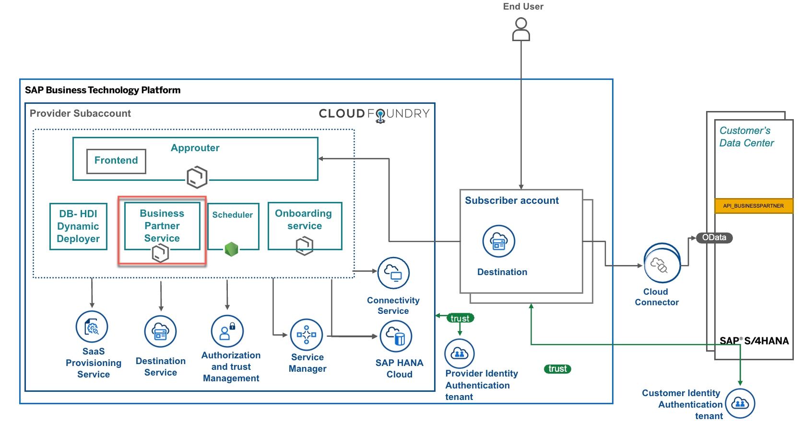

# Understand the Business Partner Service
The Business Partner service is a microservice that is the core of this Easy Franchise applicaiton.

# API Endpoints 
The API endpoints can be accessed by adding the following to the end of the URL: `/api-docs`
This opens a Swagger definations of the endpoints and the parameters needed to call them.
Here's a screenshot of APIs from the swagger documentation:

## Local Setup
To run the application locally, use the command:

`npm run start:dev`

## Application Structure

