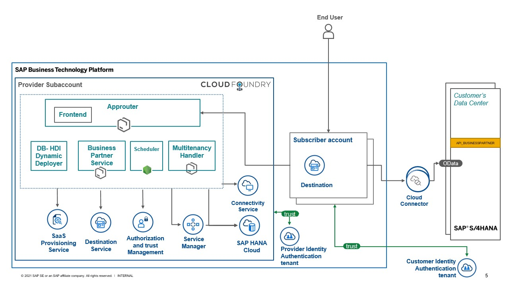

# Learn About the Goal and Outcome of the Mission

Going through the mission, you will:
* Get aligned with the concept of Software-as-a-Service (SaaS) on SAP BTP
* Learn how to build a multitenant application with SAP HANA Cloud and the SAP Cloud Application Programming Model.
* Learn how to subscribe a customer and connect his SAP S/4HANA system to your SaaS solution.

## Solution Highlights
- Multitenancy (tenant-specific access)
- Authentication and authorization of users
- Service Manager implementaion for Schema creation and access
- Database Credentials Caching for faster access
- Tenant provisioning
- Reuse of service dependency callback implementation
- Use of SAP Cloud SDK to read/write data from SAP S/4HANA

## Develop the Multitenant Application

In the SAP BTP, Cloud Foundry environment, you can develop and run multitenant applications that can be accessed by multiple consumers (tenants) through a dedicated URL.

## Context
When developing tenant-aware applications in the Cloud Foundry environment, keep in mind the following general programming guidelines:

- Ensure shared in-memory data such as Java static fields will be available to all tenants.

- Avoid any possibility that an application user can execute custom code in the application JVM, as this may give them access to other tenants' data.

- Avoid any possibility that an application user can access a file system, as this may give them access to other tenants' data.

- Perform internal tenant onboarding activities, such as creating a database schema for tenants. To do that, you must implement the Subscription callbacks of the SAP Software-as-a-Service Provisioning service (saas-registry) and use the information provided in the subscription event. You can also implement the `getDependencies` callback to obtain the respective dependencies when reusing any SAP services in your application. 

[Further Read](https://help.sap.com/products/BTP/65de2977205c403bbc107264b8eccf4b/ff540477f5404e3da2a8ce23dcee602a.html)

## Solution Diagram 

## Technical Architecture Modeling (TAM) Diagram

