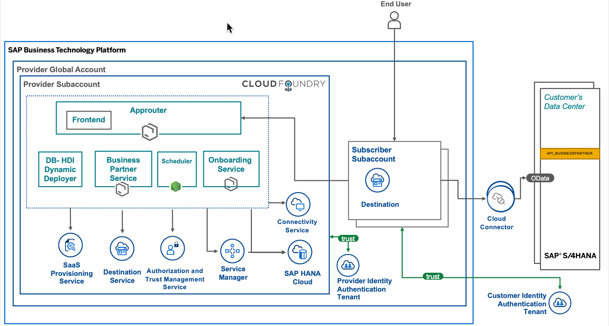
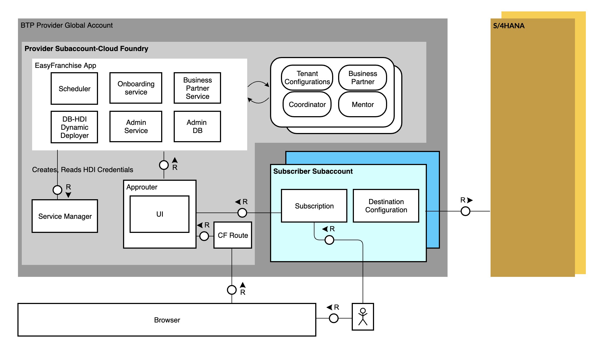

# Learn About the Goal and Outcome of the Mission

Going through the mission, you will:
* Get aligned with the concept of Software-as-a-Service (SaaS) on SAP BTP
* Learn how to build a multitenant application with SAP HANA Cloud and the SAP Cloud Application Programming Model.
* Learn how to subscribe a customer and connect his SAP S/4HANA system to your SaaS solution.

## Solution Highlights
- Multitenancy (tenant-specific access)
- Authentication and authorization of users
- Service Manager implementation for schema creation and access
- Database Credentials Caching for faster access
- Tenant provisioning
- Reuse of service dependency callback implementation
- Use of SAP Cloud SDK to read/write data from SAP S/4HANA

## Solution Diagram 

## Technical Architecture Modeling (TAM) Diagram

