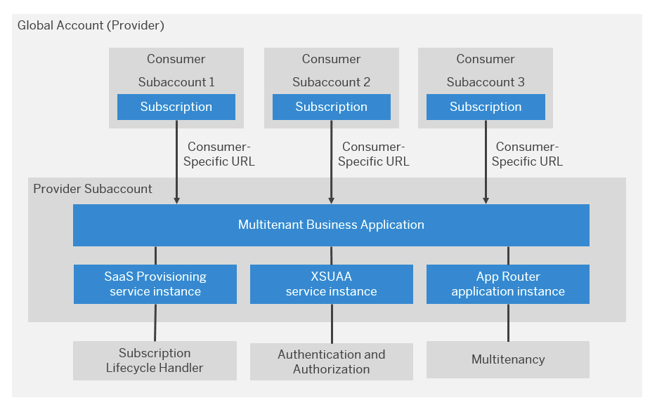
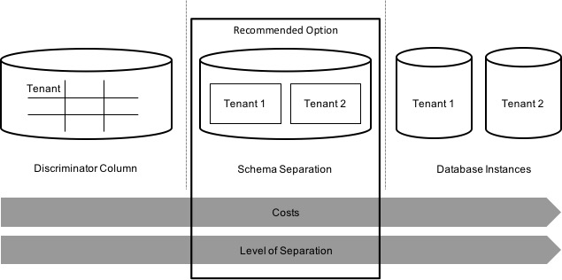

## Understand the Multitenancy

In SAP BTP, Cloud Foundry environment, you can develop and run multitenant applications that can be accessed by multiple consumers (tenants) through a dedicated URL. See [Developing Multitenant Applications in the Cloud Foundry Environment](https://help.sap.com/docs/BTP/65de2977205c403bbc107264b8eccf4b/5e8a2b74e4f2442b8257c850ed912f48.html?version=Cloud) in SAP Help Portal.

## Context
When developing tenant-aware applications in the Cloud Foundry environment, keep in mind the following general programming guidelines:

- Shared in-memory data such as Java static fields are available to all tenants.

- Avoid any possibility that an application user can execute custom code in the application JVM, as this may give them access to other tenants' data.

- Avoid any possibility that an application user can access a file system, as this may give them access to other tenants' data.

- To perform internal tenant onboarding activities, such as creating a database schema for tenants, you must implement the Subscription callbacks of the SAP Software-as-a-Service Provisioning service (saas-registry) and use the information provided in the subscription event. You can also implement the getDependencies callback to obtain the dependencies of any SAP reuse services by your application. See details in the procedure below.

[Further Read](https://help.sap.com/products/BTP/65de2977205c403bbc107264b8eccf4b/ff540477f5404e3da2a8ce23dcee602a.html)

## SAP BTP Multitenancy Model

In this tutorial we are using some keywords like provider account, subscriber subaccount, provisioning, onboarding, and data isolation. 

**Provider account** 
The provider is the vendor of the application. This is the company that is going to build, deliver, and operate the multitenant SaaS solution for all the subscribers. The vendor has a **provider account**, a global account in SAP BTP.

**Subscriber subaccount** 
Subscriber is the consumer of the application. This is another company that is going to use the multitenant SaaS solution. This company buys the SaaS solution and subscribes to it. The subscriber has a **subscriber subaccount**, a subaccount of the vendor's global account in SAP BTP.

**Onboarding**
This is the process of creating a subaccount for the subscriber in the vendor's global account in SAP BTP.

**Provisioning** 
This is the process of onboarding new subscriber to the multitenant SaaS solution. During the provisioning process, tenant database schema is created, any dependency is injected into the subscriber subaccount.

### **Provider's Point of View** 

Putting this together the general account model of an SAP BTP SaaS solution would have the following structure:

## Recommendation for the Database Schema Segregation

There are multiple ways to achieve database schema segregation. We recommend that you've a dedicated database schema for each tenant. In this tutorial, we are using 'hdi-container'-based model for database schema segregation. This provides unique database schema and credentials for each of the tenant ensuring additional security and data isolation.

