# Configure your subaccount in SAP BTP
In this section we setup the SAP BTP subaccount for developing the Easy Franchise Application.

**Prerequite:** You must have an adminstrator role for SAP BTP

1. Login to SAP BTP Cockpit and select your global account.
2. In the Account Explorer choose **Create - Subaccount**
   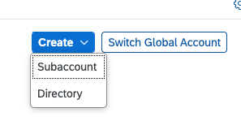
3. In the popup enter the following values
   
   *  Display Name - your subaccount name
   *  Subdomain - your subdomain ID
   *  Region - the Cloud Foundry region of your choice - choose either one from Amazon Web Service, Google Cloud Platform or Microsoft Azure
   *  Parent - your global account
   
  
      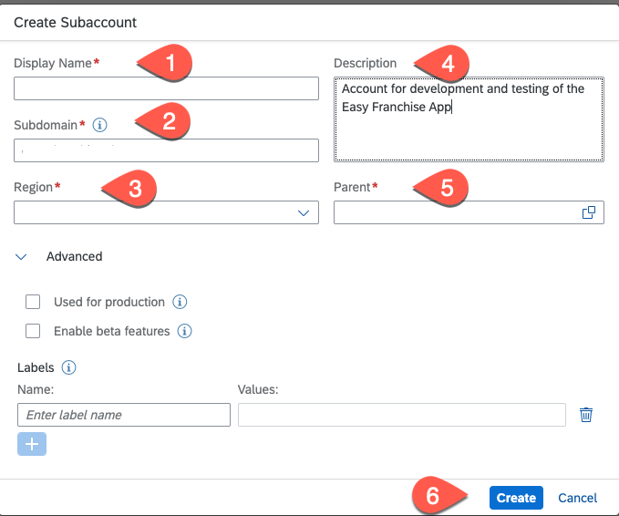

    For categorizing your subaccount you can add some labels. Press **Create**.

4. Enable Cloud Foundry Environment

   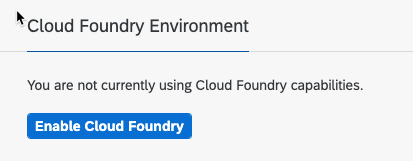

   Select the standard plan and press create.
   
   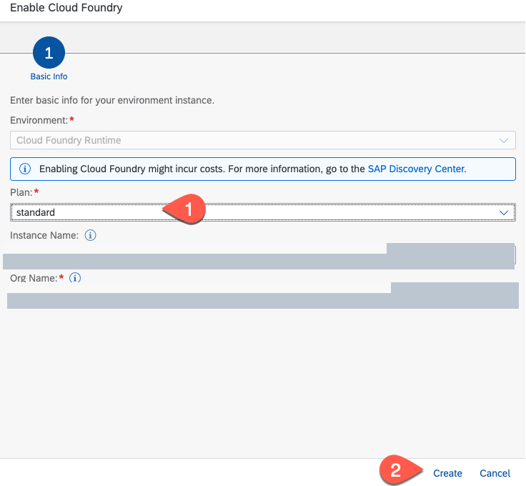

5. Add entitlements
   
   In the SAP BTP cockpit choose the **Entitlements** section, select **Configure Entitlements** and then select **Add Service Plan**.
   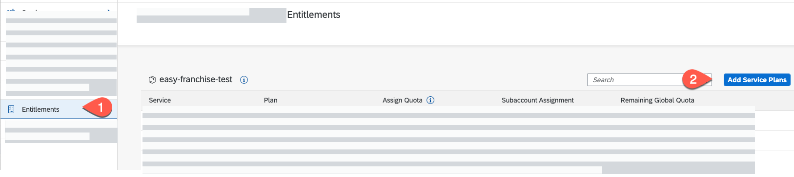

   Search for **SAP Hana Cloud** and select the **hana** service plan, for testing only you can also choose the **hana-free** plan. 

   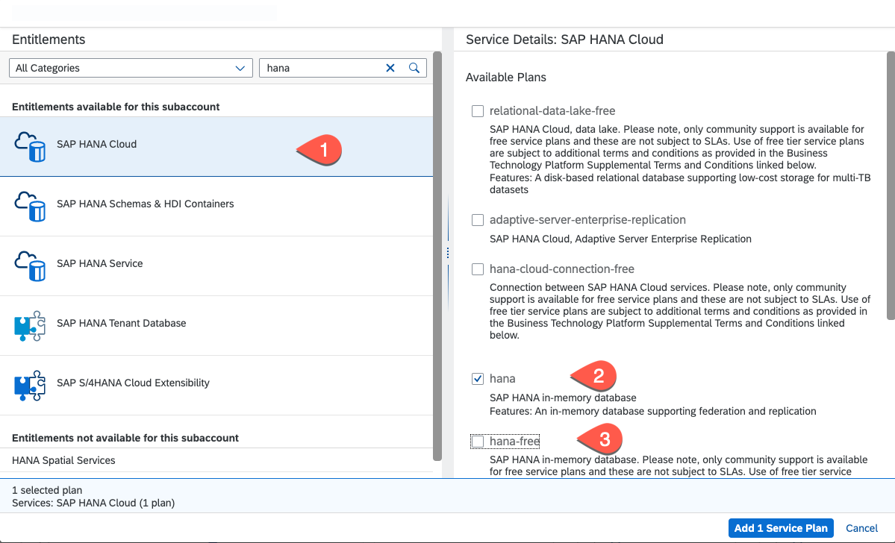
   
   Search for **Cloud Foundry Runtime** and select the **MEMORY** plan.
   
   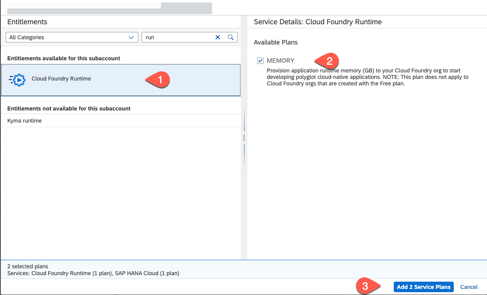

   Press **Add 2 Service Plans**
    
   In the service list search for *Cloud Foundry Runtime** and increase the Units to at least 2. For runnung a productive solution you would need additional quota as for higher availability and performance it is recommended to run multiple instances of an application.

   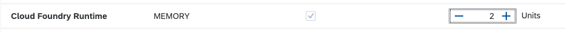

   Press the **Save** button.

6. Create Space
   Go to the **Overview** section in SAP BTP Cockpit and add a space to the Cloud Foundry Environment
   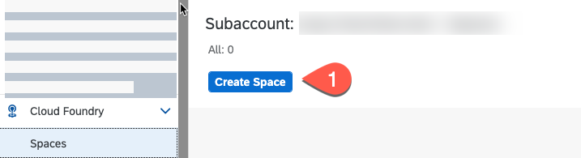

   Set the space name and assign the **Space Manager** and **Space Developer** roles to your user. 
   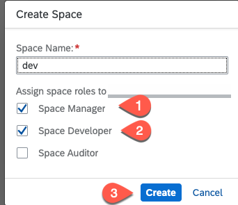

7. To add additional users to the subaccount, choose **Security - Users** and press **Create**. 
     
   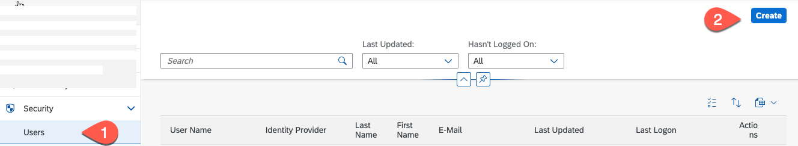
   
   The User Name must be the user ID in the selected Identity Provider. 
   
   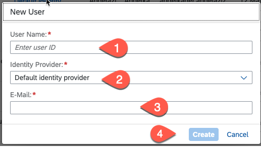

8. Assign the relevant subaccount roles to the users. Choose **Security - Role Collections**.  Select one of the role collections below:

   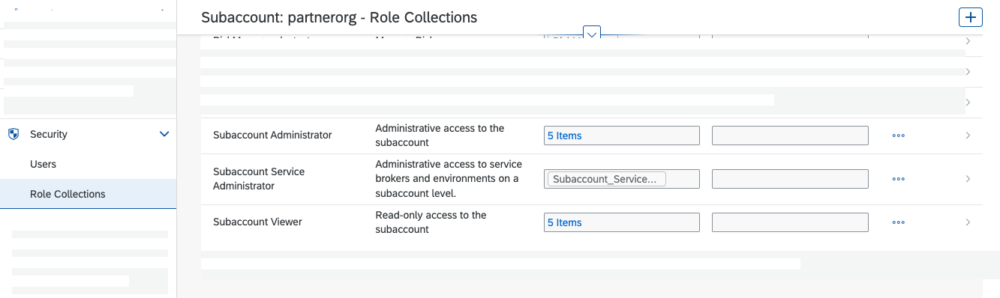

   Chosse **Edit** and then add a user by setting the User ID, selecting the relevant Identity Provider and set the user E-Mail. Press **Save**

   

9.  Add Users to space
   
   In the BTP Cockpit select **Cloud Foundry - Space** and choose your space. Then select **Members** add the emails of the team members and assign the necessary roles to them.

   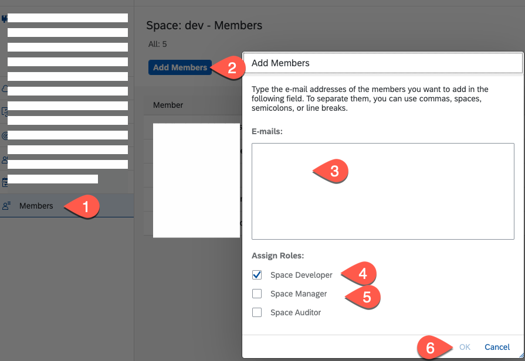

