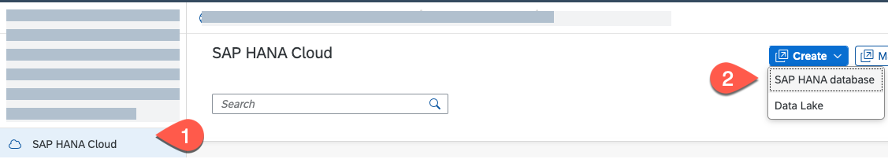
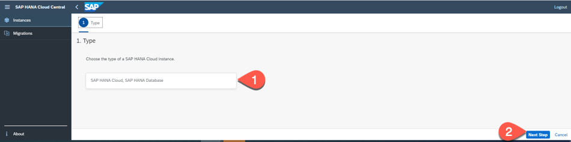
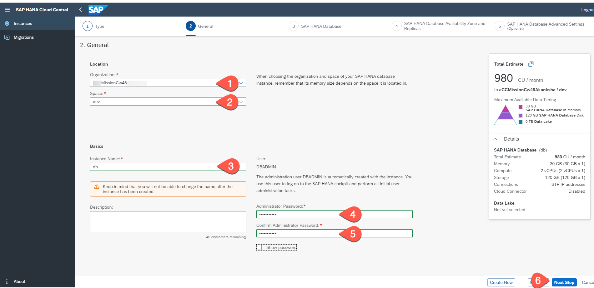
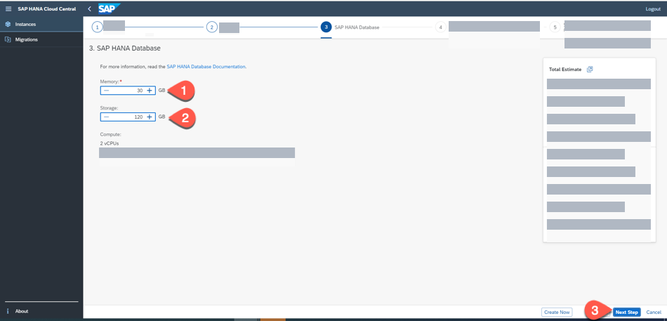
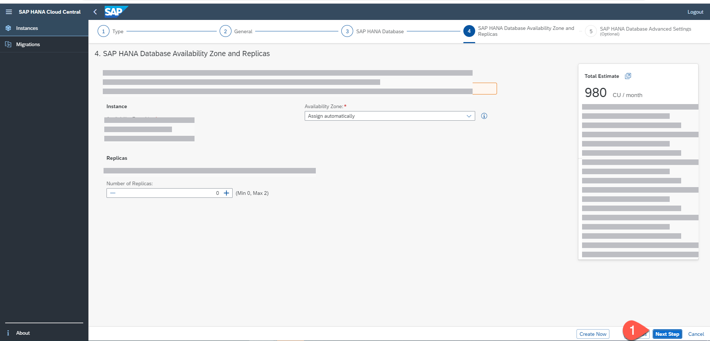
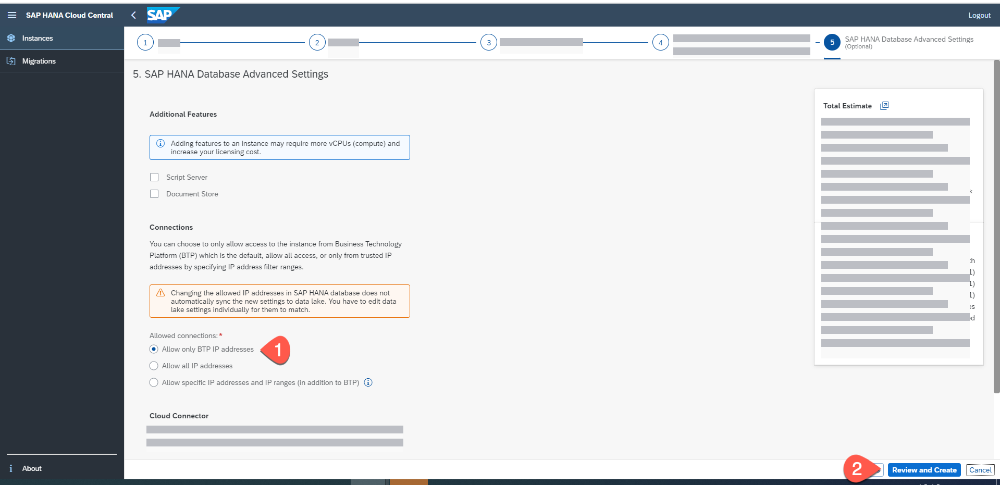
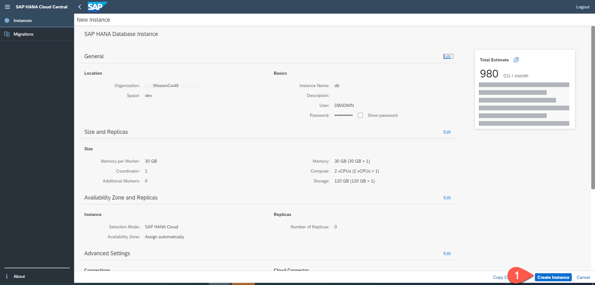

# Create a SAP HANA Cloud Instance

For this mission we will SAP HANA Cloud as our persistance layer.
Use the following steps to create a SAP HANA Cloud instance on SAP BTP:

1. In SAP BTP cockpit enter the space you have created in the previous tutorial.   

2. Select the **SAP HANA Cloud** section and choose **Create** and in the drop-down then select **SAP HANA Database**.

    

3. You will be logged-in to SAP HANA Cloud Central. Choose the type of the SAP HANA Cloud instance as **SAP HANA Cloud, SAP HANA Database** and select **Next Step**.

   
   
4. In the next tab, choose the SAP BTP **Organization** and **Space** from the drop-down box. Enter an **Instance name**, also enter a valid database **Administrator Password** and select **Next Step**.

   

5. Select the **Memory** and **Storage** capacity for your SAP HANA Cloud database instance. For this mission, you can choose the minimum capacity and select **Next Step**.

    
  
6. In the tab for Availability Zone and Replicas, you can leave the defaults and choose **Next Step**. 

       
   
7. In the tab for SAP HANA Advanced Settings, you can leave the default values to **Allow only SAP BTP IP Addresses** and choose **Review and Create**.

   

8. Choose **Create Instance** to create an instance of SAP HANA Cloud Database instance.

    

    The creation of the instance will take some minutes.

