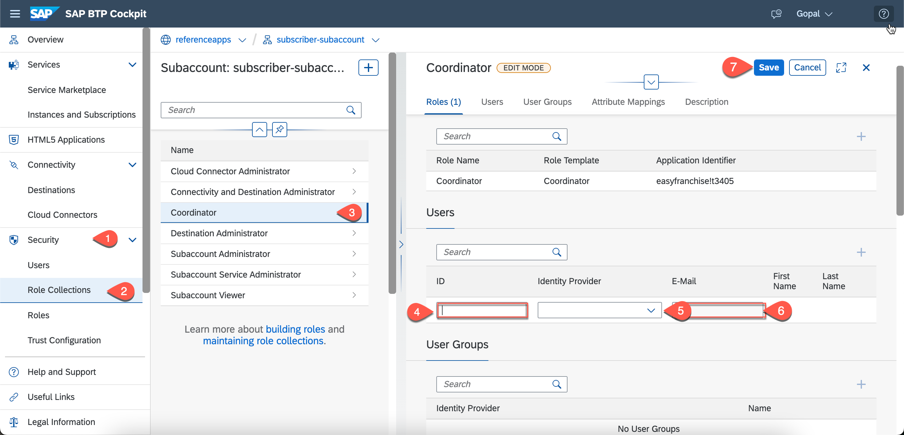

# Assign Roles

To access the application, the user needs to be assigned with **Coordinator** role. To assign this role to an individual user, you've to: 

1. In the SAP BTP cockpit, navigate to your subaccount. 
2. Choose **Security** > **Role Collections**.
3. Choose the **Coordinator** role collection.
4. In the **Coordinator** role collection screen, choose **Edit**.

   
   
5. In the **Users** section, enter your email in the **Search** field.
6. Select your identity provider.
7. Enter your email.
8. Choose **Save**. 

For assigning user groups to the role collection, see [Custom Identity Provider](../idp/README.md).
   
