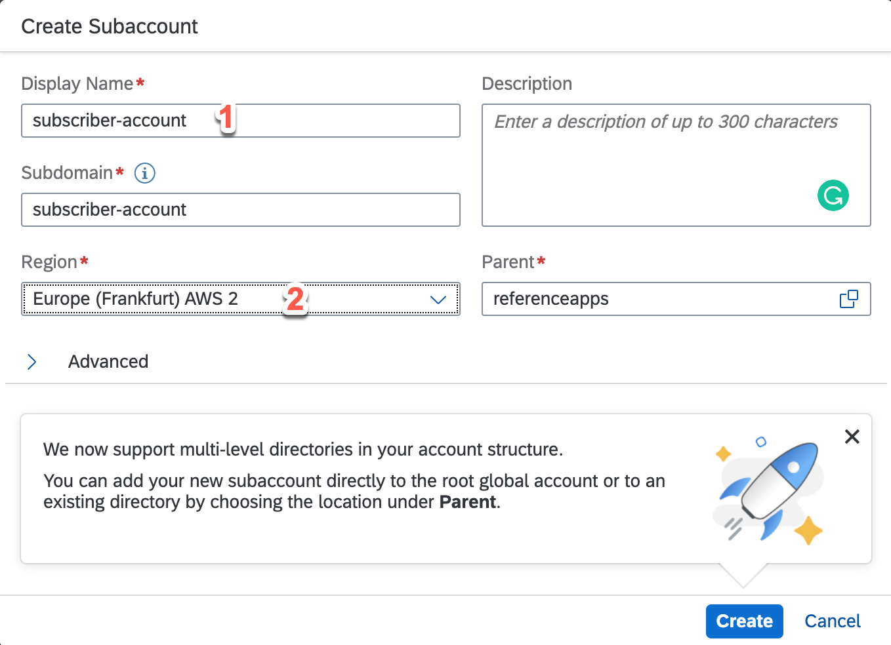

# Create a Customer Subaccount 
Once the multitenant application is deployed, it's time to create a subaccount in SAP BTP for the customer of this application. For each customer, you need a different subaccount that is part of the global account in SAP BTP that belongs to the SAP partner providing the multitenant application.

These subaccounts are created and configured by an administrator in SAP BTP. They must be created in the same region where the application is deployed. For example,  if the multitenant application is deployed in the **us-east-1** region, the subaccounts must be created in the **us-east-1** region as well. The multitenant application is visible only in the region where it's deployed.

Follow these steps to create a subaccount:

1. In the SAP BTP cockpit, navigate to the global account, choose **Account Explorer**, and then choose **Create** > **Subaccount**.
2. In the **Create Subaccount** wizard:
    * Enter a name for the subaccount.
    * Select a region from the dropdown menu. Make sure the region is the same region where the multitenant application is deployed.
6. Choose **Create**.

