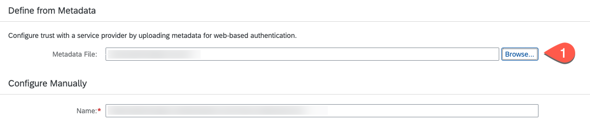
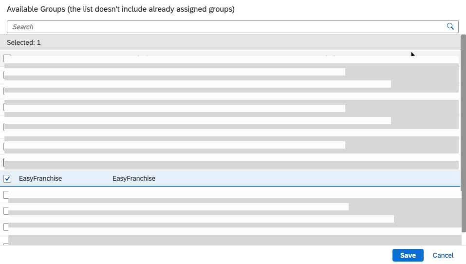

# Configure Custom Identity Provider

## Introduction

In this section, we'll configure a custom identity provider. This identity provider is then used by the subscribers to access the multitenant application. The subscriber can have their own corporate identity providers, using this step trust is established between the BTP subaccount and custom identity provider. 
Depending on your global account, you might see the default identity provider, which is configured automatically. The default identity provider can't be deleted, it can only be enabled or disabled. 

## Prerequisites

Your user has administrative rights in the global account and in the subaccount in SAP BTP.

## Procedure

An SAML service provider interacts with an SAML 2.0 identity provider to authenticate users signing in using the single sign-on (SSO) mechanism. In this scenario, the Identity Authentication service acts as a service provider representing a single subaccount. To establish the trust between an identity provider and a subaccount, you must provide the SAML details for a web-based authentication in the identity provider itself. Administrators must configure the trust on both sides, in the subaccount of the service provider and in the SAML identity provider. Here, we assume that the customer has purchased a tenant for the Identity Authentication service.

### Register Your Subaccount in SAP BTP in the Custom SAML 2.0 Identity Provider.

You can manage the trust configurations for a global account only if you've created the global account or if you're an SAP BTP administrator of the account and you're an administrator in the company's Identity Authentication tenant.

1. In the SAP BTP cockpit, navigate to the customer subaccount.
2. Choose **Security** > **Trust Configuration**. 
3. Choose **SAML Metadata** and download the XML file.
   
   
   
4. Open and log it to the company's Identity Authentication tenant.
5. Choose **Application & Resources** > **Application**.
6. Choose **Create**.
   
   
   
7. Enter a name. For example, **Easy Franchise**. 
8. In the **Type** field, select **SAP BTP solution**.
9. Choose **Save**.

   
   
9. In the **Trust** tab, choose **SAML 2.0 Configuration**.
   
   
   
10. In the **Define from Metadata** section, choose **Browse**. Select the metadata XML file you've downloaded in **step 3**.

      

11. Choose **Save**.

12. Choose **Subject Name Identifier**.
    
    
   
13. Select the **Basic Configuration** radio button and select **E-Mail** for a basic attribute. Choose **Save**.
   
    

14. Select **Assertion Attributes**.
    
    

15. Choose **Add** and select the Groups attribute. Set the assertion attribute to **Groups** with capital **G**. Choose **Save**.
 
     

16. Choose **Home** and then choose **User Groups**.

   

17. Create an Easy Franchise group:
    1. Choose **Create**.
    2. In the **Name** field, enter **EasyFranchise**.
    3. In the **Display Name** field, enter **EasyFranchise**.
    4. Enter a description.
    5. Choose **Create**.

   

  
18. Map the group to a user who has the UX extension developer role:
    1. Choose **User Management**.
    2. Select the user.  
    3. Choose **User Groups** and then choose **Assign Groups**.
   
   

19. Select the **EasyFranchise** checkbox and choose **Save**.
   
   

20. Repeat the last two steps by mapping the **EasyFranchise** group to all the users that should have access to the Easy Franchise application. 

### Establish Trust with a Custom SAML 2.0 Identity Provider in Your Subaccount.

You've your company's SAML 2.0 identity provider, for example, the Identity Authentication service. This is where your business users are stored. You must establish a trust with your custom SAML 2.0 identity provider in your subaccount in SAP BTP. The following procedure describes how to establish trust in the Identity Authentication service.

1. Choose **Application & Resources** > **Tenant Settings**.
2. Choose **SAML 2.0 Configuration**.

    
   
3. Choose **Download Metadata File**.

   
   
4. In the SAP BTP cockpit, navigate to the customer subaccount. Choose **Security** > **Trust Configuration**.
5. Choose **New Trust Configuration**.
 
   
   
6. Choose **Upload** to upload metadata file. Choose the tenant metadata file downloaded in **step 3**.
7. Enter a name. For example, **City Scooter**
   
   
   
8. Choose **Save**.
9. Assign the group we've created at the Identity Authentication tenant to the role collection of the Easy Franchise application. In the SAP BTP cockpit, choose **Security** > **Role Collection**. Choose **Coordinator**, and then choose **Edit**. In the **User Groups** section, select your identity provider and map it to the **EasyFranchise** group. Choose **Save**. 

   

### References
See [Manually Establish Trust and Federation Between UAA and Identity Authentication](https://help.sap.com/viewer/65de2977205c403bbc107264b8eccf4b/Cloud/en-US/7c6aa87459764b179aeccadccd4f91f3.html) in SAP Help Portal.
