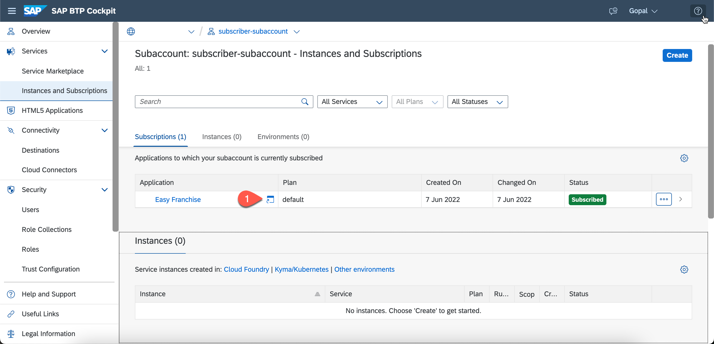
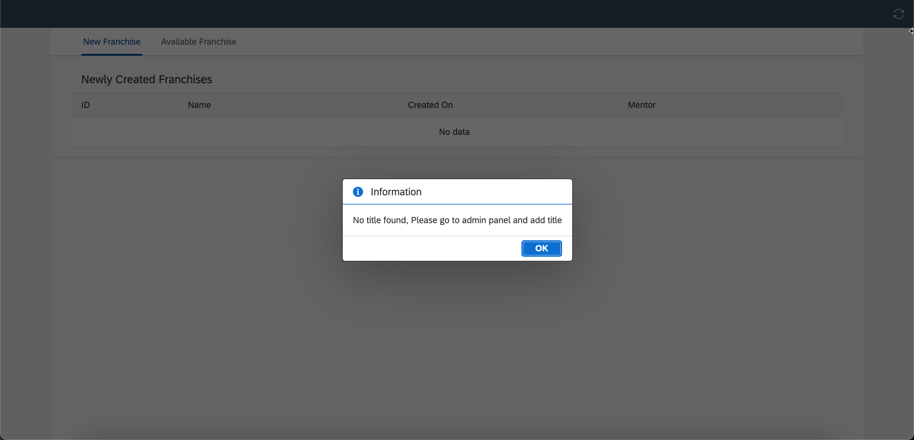
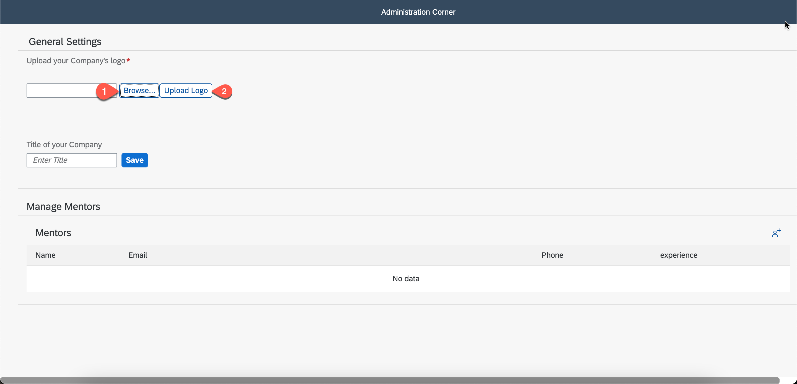
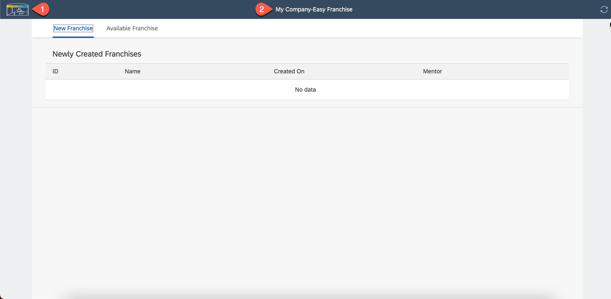

# Run the Easy Franchise Application 

To run the Easy Franchise application, follow these steps:

1. In the SAP BTP cockpit, navigate to your subaccount and choose **Services** > **Instances and Subscriptions**.
2. Choose **Easy Franchise**.
3. Choose **Go to Application**.
   
   
4. You'll load the Easy Franchise multitenant application. 
   

At this step, you're ready to run the application. To customize the application with a subscriber-specific title and icons, you need to follow the steps below.

## Customizing the Application
Each customer needs to have a unique title and icon. To customize the application, follow these steps:

1. Change the application URL, add `/adminui/` after `.com`. It looks like this: `https://<your-subaccount>.com/adminui/`.
2. Change the application logo by choosing **Browse** and selecting the logo.
3. Choose **Upload** to upload the logo.
   
   
4. Enter the title for the subscriber tenant. Choose **Save**.
    
5. Create new mentors by choosing `+`. Fill in the required details. 

Once you're ready with the customization, you can go to the main application. Now, the customized application has its own title and logo uploaded from the admin corner.

6. Go to the S/4HANA system and create a new Business Partner.
7. To Create a new Business Partner you can follow these [steps](https://github.com/SAP-samples/cloud-extension-ecc-business-process/blob/mission/mission/run-demo/README.md#add-new-business-partner-in-backend)
8. In the SearchTerm1 fill `EFVERIFIED`Click on Create.
9. Go to the application.
10. Select the Refresh icon at the top right of the screen.
11. Under the New Franchise Tab, the new Business Partner will be visible
12. From the mentor column, click on the dropdown and select the mentor name.
13. The Mentor will be assigned to the new Business Partner.
14. Go to the S/4HANA system, and open the business partner. 
15. In the `search term`, check if the mentor details are visible. 
16. This will conclude the flow of the application. 