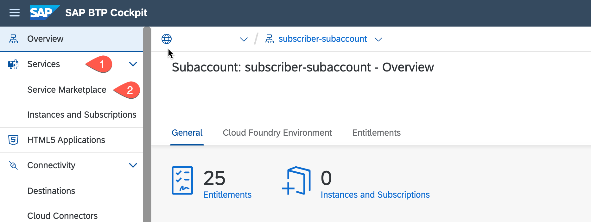
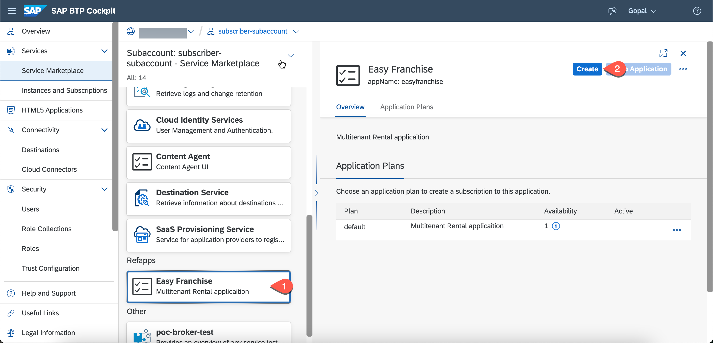
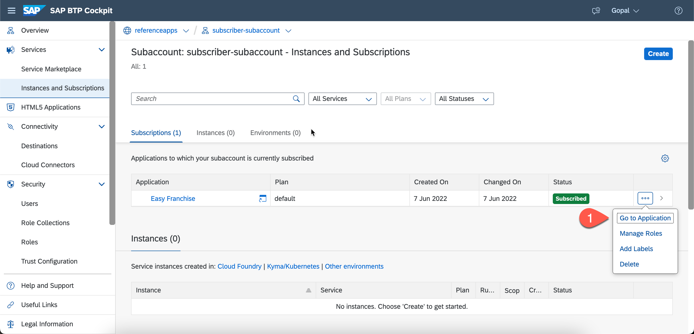

# Subscribe the Easy Franchise Application 
This step is going to guide you through the process of subscribing to the Easy Franchise application.

## Steps
1. Go to the newly created subscriber subaccount.
2. Click `Services` on the left side and then select `MarketPlace` as shown in the below picture.
   
3. Now, Search for your Deployed Multitenant Application and click on `Create`.
   

4. In the dialog click on `Create`. This starts the onboarding process. It takes some time to complete. 
5. Once subscription was successful, you'll see the following outcome. 
   .

